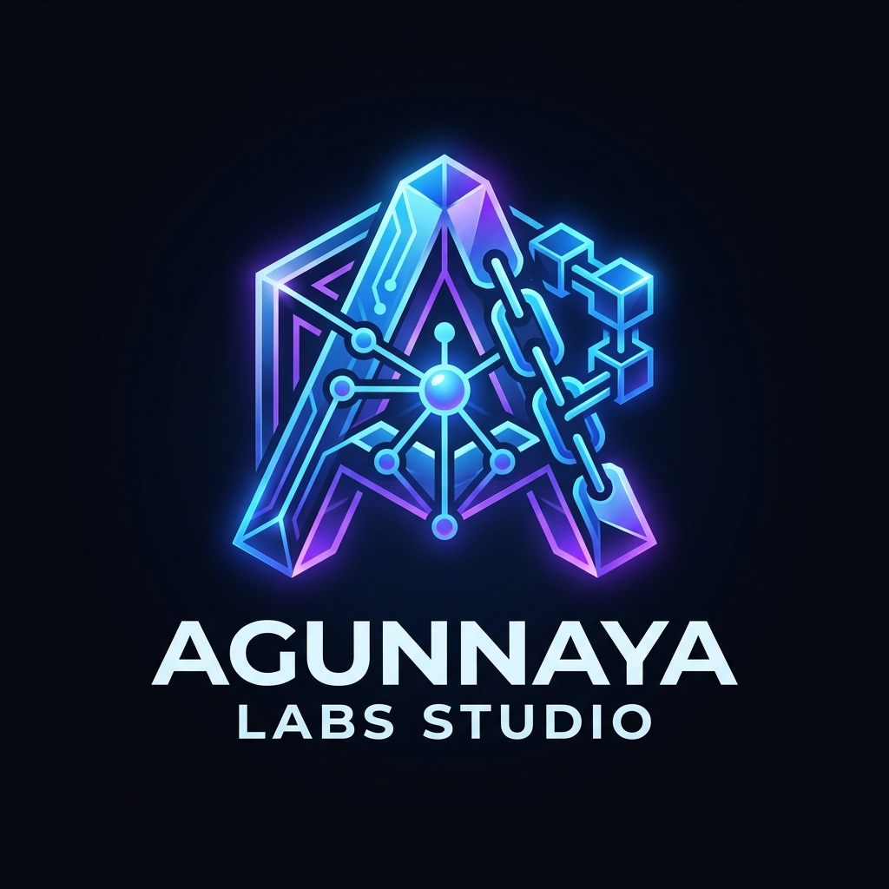

# 🌌 Agunnaya Labs Studio

<div align="center">

[](public/banner.jpg)

  <p align="center">
    
  </p>

  <h2 style="margin: 0; padding: 0; color: #FFFFFF; font-family: sans-serif;">Agunnaya Labs Studio (v2.5)</h2>
  <p style="margin: 4px 0 0 0; color: #A1A1AA; font-size: 14px;">The AI-Powered Web3 Developer Studio, Token Launchpad & Autonomous Cloud Hub on Base</p>

  <div style="display: flex; gap: 8px; flex-wrap: wrap; justify-content: center; margin-top: 14px; margin-bottom: 20px;">
    
    
    
    
    
    
    
  </div>
</div>

> **Agunnaya Labs Studio** is an all-in-one, full-stack Web3 creator suite, autonomous agent fleet, and token launchpad built for the Base L2 ecosystem. It allows developers, creators, and protocols to design, deploy, audit, manage, and scale smart contracts, AI agents, bonding curve tokens, DAOs, and DeFi protocols on Base without writing Solidity from scratch.

---

## 🏛️ Verified On-Chain Smart Contracts (Base Mainnet)

| Contract | Address | Network | Description |
| :--- | :--- | :--- | :--- |
| **AgunnayaDAO** | `0x3fFCb92A17caeaAd1342DD76978b566C8aEC7010` | Base (8453) | Production Governor DAO with on-chain proposal voting and timelock execution |
| **TimelockController** | `0x900D315C91D9e54F3fa3412D475009d905bf6744` | Base (8453) | 24-hour governance delay securing treasury and system parameters |
| **AGLVotesWrapper (wAGL)** | `0xA27C9BA04D06EcAF766EF4e074b403DAf19A3d69` | Base (8453) | ERC20Votes token wrapper for snapshot vote tallying |
| **AGL Token Factory** | `0x6EF504b98b4369C0a1aF4fD1885D7acCf843dDf6` | Base (8453) | Canonical launchpad factory for ERC-20 tokens & bonding curves |
| **$AAIC (Agunnaya AI Core)** | `0xa19a0B2C7e00EB4e9619c0Bf1B1Ae00Ee23AB6B5` | Base (8453) | Native AI agent and studio compute utility token | 

---

## 🎨 Visual Identity & Theme: *Immersive UI*

Agunnaya Labs Studio features a tailored **Immersive UI** design system built for high-density Web3 developer productivity:

*   **Atmospheric Ambient Glows**: Real-time canvas radial glows shifting dynamically between Base Blue (`#0052FF`) and Mystical Purple (`#A855F7`).
*   **Tactile Micro-Grid Layout**: Precision 1px border divisions (`border-white/10`) set against an ultra-dark background (`#050505`) with `#0a0a0a` sidebar containers.
*   **Vibrant Glassmorphism**: Interactive panels (`glass-panel`) with hover micro-transitions, glowing shadows, and responsive card geometry.
*   **Custom Toast Subsystem**: Native browser alerts are completely replaced by an animated Toast Notification Subsystem with clear-cut status borders and clear exit controls.
*   **Dual Network Flexibility**: Live toggle between **Base Mainnet** and **Sepolia Sandbox** with real-time status cues, live block explorers, and faucet integrations.

---

## 📊 Comprehensive User Dashboard (*Mission Control*)

The **User Dashboard** serves as the central command center for your entire Web3 portfolio, deployment operations, and developer journey on Base:

### 1. 🛡️ Secured Web3 Identity & Profile Card
*   **Multi-Provider Recognition**: Seamlessly identifies connected identity types (Coinbase Smart Wallet, MetaMask EOA, WalletConnect, and Account Abstraction Smart Accounts).
*   **Cryptographic Address Inspector**: Truncated 0x address display with 1-click clipboard copy, QR code popover for mobile wallet scanning, and direct BaseScan explorer inspection.
*   **Secure Link Health**: Real-time visual network indicator confirming live, low-latency cryptographic connection to Base Mainnet.

### 2. ⚡ Account Abstraction Gas Sponsorship Meter
*   **Sponsored Dev Gas Tracker**: Live progress meter tracking subsidized gas credits (up to `0.0500 ETH`) allocated to your wallet.
*   **Zero-Cost Execution**: Automatically covers gas fees for token launches, DAO voting, bonding curve trades, and staking vault deposits.
*   **Gas Faucet & Management**: 1-click access to the Gas Dashboard to request additional developer gas sponsorship or inspect live Base gwei rates.

### 3. 📈 Developer Lifetime Metrics & Yield Analytics
*   **Deployed Projects Counter**: Real-time tally aggregating all tokens, NFT collections, DAOs, GameFi arenas, and AI agents deployed by your connected address.
*   **Cumulative Curve Fees Earned**: Tracks aggregate ETH revenue earned across all your deployed linear bonding curves with live claim settlement status.
*   **AGL VIP Fee Tier**: Displays active fee discount tiers (e.g. 10% fee reduction across all swaps when holding or staking native $AGL tokens).

### 4. 🎯 Daily Missions & Developer Quests Hub
*   **Gamified Dev Challenges**: Complete daily actions (launching a token, swapping on bonding curves, casting a DAO vote, querying an AI Agent, staking in vaults) to earn XP points.
*   **Streak Counter**: Multi-day active developer streak multipliers amplifying bonus rewards.
*   **1-Click Reward Settlement**: Claim daily AGL token bonuses and AI Studio compute credits directly into your connected wallet.

### 5. 📅 TaskSync Summary Widget
*   **Pinned Sprint Tasks**: Displays your top 3 pending high-priority developer tasks directly on the dashboard canvas.
*   **Status Badges & Progress**: Real-time status pills (Pending, In Progress, Completed) synchronized with Firebase Firestore cloud storage.
*   **Quick Sprint Jump**: 1-click link transitioning directly into the full TaskSync kanban and roadmap orchestrator.

### 6. 🪙 Created Tokens & Deployed Contracts Registry
*   **Multi-Attribute Sorting**: Dynamically sort your deployed tokens by **Market Cap**, **Launch Date**, or **Liquidity Pool Size**.
*   **Scope Filtering**: Toggle seamlessly between `My Created Tokens` and `All Studio Deployed Tokens`.
*   **Inline Contract Tools**: Direct 1-click clipboard copying for contract addresses, BaseScan transaction links, instant **Security Audit** trigger, and **Contract Verification** modals.

### 7. 📜 Real-Time Activity Feed & Historical Audit Log
*   **Live Event Streaming**: Chronological timeline capturing token creations, buy/sell trades, DAO ballot votes, AI agent chats, and staking vault deposits.
*   **Dual Storage Persistence**: Instant synchronization between browser storage and Firebase Firestore for cross-session audit trails.

---

## 🚀 Core Features & Studio Modules

### 1. 🧙‍♂️ AI Token Deployment Wizard & Smart Contract Architect
*   **AI Token Deployment Wizard**: Input natural language requirements (e.g. token name, symbol, supply, royalty fees, anti-whale caps, staking APY), and Gemini AI auto-synthesizes bonding curve slop[...] 
*   **Interactive Price Trajectory Visualizer**: Recharts area chart rendering the proposed bonding curve trajectory up to Uniswap v3 liquidity graduation targets with real-time parameter fine-tuning [...]
*   **1-Click Launch & Auto-Fill**: Transfer AI-proposed parameters directly to the launchpad form or trigger a 1-click deployment directly to Base Mainnet or Sepolia Sandbox.
*   **Gemini AI Contract Architect**: Describe desired token mechanics or contract specifications in plain English, and Gemini auto-assembles verified Solidity-inspired contracts.
*   **1-Click AI Suggestion Templates**: Instant prompt chips for Meme Coins, Staking Vault Tokens, AI Agent Cores, DAO Multi-Sig Hubs, and GameFi Reward Pools.
*   **On-Chain Bonding Curve**: Deploy ERC-20 tokens on a linear bonding curve ($P(S) = P_0 + k \cdot S$) with zero admin keys and instant liquidity provision.

### 2. 📦 Batch Token Launchpad (CSV & Queue Engine)
*   **CSV & Drag-and-Drop Ingestion**: Upload `.csv` or `.txt` token manifest files or paste raw comma-separated values to automatically parse and queue dozens of tokens for deployment.
*   **Interactive Queue Manager**: Real-time parameter validation for token name, ticker symbol, initial supply, and category with status indicators (`Ready`, `Deploying`, `Success`, `Error`, `Invalid[...]`)
*   **Dual-Pipeline Execution**:
    *   **Simulated Sandbox Fast Rollout**: High-speed deterministic deployment pipeline for rapid testing and gas-sponsored simulation.
    *   **Live Web3 On-Chain Engine**: Sequential on-chain execution calling `createToken(_name, _symbol)` directly on the Base Token Factory contract.
*   **Playback & Control System**: Live progress percentage bars, pause/resume execution toggles, and cancellation safety stops.
*   **Exportable Reports**: Download complete batch deployment receipts in both `.csv` and `.json` formats with BaseScan transaction hashes and generated contract addresses.

### 3. 📈 Bonding Curve Mathematical Analytics & Slippage Simulator
*   **Continuous Curve Visualizer**: Recharts multi-series area and line chart mapping price progression $P(S) = P_0 + k \cdot S$ with shaded trade execution windows.
*   **Slippage & Price Impact Metrics**: Real-time calculations comparing starting spot price ($P_{\text{start}}$), post-trade spot price ($P_{\text{end}}$), and expected average execution price ($P_{[...}$)
*   **Volume Sensitivity Heatmap Grid**: Interactive table detailing price impacts across various buy order volumes ($0.05$ to $5.0$ ETH) with 1-click order execution filling.
*   **Uniswap v3 DEX Graduation Meter**: Live tracker monitoring reserve growth toward the 10 ETH liquidity graduation target for automated AMM migration.
*   **Closed-Form Mathematical Specs**: On-screen reference displaying integral reserve equations $R(S) = P_0 S + \frac{1}{2} k S^2$ and exact closed-form square-root token minting logic.

### 4. 🧠 Autonomous AI Agent Studio & Persona Forge
*   **Agent Creation & Registration**: Forge autonomous AI workers with custom symbols, system prompt directives, and usage subscription fees (in ETH).
*   **Personality & Persona Configuration**: Fine-tune agent cognition with specific **Tone** (Professional, Witty, Concise, Friendly, Analytical), **Response Depth** (Short, Medium, Long), and **Pers[...]
*   **Preset AI Agent Suggestions**: 1-click presets for Solidity Security Sentinel (`AUDIT`), DeFi Yield Scout (`YIELD`), and DAO Governance Advisor (`GOV`) with pre-configured cognitive personas.
*   **Multimodal AI Engine**: Direct integration with Gemini LLM, speech-to-text audio transcription, AI image generation, and video synthesis.
*   **Prompt Optimization Pipeline**: 1-click AI directive tuner that transforms simple descriptions into detailed autonomous cognitive instructions.

### 5. 📅 TaskSync: Autonomous Developer Synchronizer
*   **Cross-Chain Task Management**: Specialized module for tracking on-chain development tasks, audits, and deployments across the Base ecosystem.
*   **Priority-Based Queueing**: Organize workflows with High, Medium, and Low priority tiers and real-time status tracking (Pending, In-Progress, Completed).
*   **Draggable Dashboard Widget**: A persistent, pinned summary widget on the main dashboard providing 1-click visibility into the top 3 pending high-priority tasks.
*   **Local & Cloud Sync**: Seamless synchronization between browser LocalStorage and Firebase Firestore for persistent task history.

### 6. 🛡️ Automated Smart Contract Security Audit & Verification Engine
*   **1-Click Quick Security Audit**: Trigger an automated, simulated security scan directly from the Token Creation card, Token Creator Inspector, or On-Chain Registry cards.
*   **Common ERC-20 Vulnerability Badges**: Evaluates potential smart contract attack vectors in real time, displaying color-coded status badges for:
    *   **Honeypot & Transfer Tax Traps**: Verifies 0% buy/sell fees and unhindered transferability.
    *   **Mint Authority & Supply Caps**: Inspects minting functions and total supply caps against infinite inflation exploits.
    *   **Blacklist & Pausable Hooks**: Detects malicious blacklisting arrays or arbitrary account freezing.
    *   **Ownership Privileges & Renouncement**: Validates contract ownership status (Renounced vs. Multi-Sig / Timelock).
    *   **Reentrancy & Math Safety**: Confirms Solidity `0.8.20` overflow protection and OpenZeppelin reentrancy guards.
*   **Security Score & Risk Profiling**: Computes a deterministic 0-100 Security Score (Low, Moderate, High, Critical) with progressive terminal logs and interactive audit modals.
*   **BaseScan Verification Bridge**: 1-click modal with auto-populated Solidity compiler versions (`v0.8.20`), optimization flags, and OpenZeppelin standard source code for BaseScan verification.

### 7. 🔥 ERC-20 Token Burner, Batch Multicall & Deflation Engine
*   **Dual-Mode Burning (Single & Multicall Batch)**: Burn a single asset or select multiple tokens simultaneously to execute a single multicall batch-burn transaction using the canonical `Multicall3`[...]
*   **Burn Leaderboard**: Displays top burner wallets, cumulative deflation rankings, and total tokens permanently removed from circulation using real-time database synchronization.
*   **Dual Destination Mechanisms**: Send tokens to the standard unspendable EVM Dead Address (`0x000...dEaD`) to permanently reduce circulating supply, or burn $AGL tokens to receive Agunnaya AI Stud[...]
*   **Multi-Asset Cryptographic Proof of Burn Certificates**: Interactive verification certificates detailing burner address, null target, block number, individual token amounts, transaction hash, and[...] 

### 8. 🔍 Token Registry Search, Filter & Discovery Suite
*   **Instant Search & Query**: Search tokens across the Base Mainnet factory by token name, ticker symbol, contract address, or creator wallet address.
*   **Category Scope Filtering**: Filter registry items by `All`, `My Created Tokens`, `Verified`, `Utility`, `GameFi`, `AI Agents`, and `DeFi`.
*   **Flexible Sorting**: Sort tokens dynamically by `Latest Deployed`, `Name (A-Z / Z-A)`, or `Symbol (A-Z)`.

### 7. 💬 Categorized AI Web3 Advisor Drawer & Floating Developer Dock
*   **Floating AI Drawer**: Accessible from anywhere in the applet via the floating action button (`#floating-ai-activator`) or shortcut tooltips.
*   **Developer Quick Actions Menu**: Right-clicking `#floating-ai-activator` opens a sleek contextual menu for 1-click access to **Deploy Contract**, **View Analytics**, **Open Terminal**, and **AI P[...]
*   **Quick Copy Wallet Address**: 1-click clipboard button built directly into the floating dock with toast notifications and visual checkmark confirmations.
*   **Mobile Wallet QR Code Popover**: Clickable QR code button triggering a popover window displaying the active wallet's address as a QR code for mobile scanning.
*   **Interactive System Terminal Modal**: Access the full-featured Web3 CLI, RPC event streaming logs, custom themes (Classic Green, Amber, Monochrome), and command history via Quick Actions.
*   **AGL Credit Metering**: Each AI query consumes 5 AGL Credits, backed on-chain or in the Sepolia Sandbox by burning AGL tokens.

### 8. 💼 Multi-Account Wallet Studio & Aggregate Portfolio Reserves
*   **Simultaneous Multi-Sub-Account Tracking**: Connect and track multiple sub-accounts (MetaMask EOA, Coinbase Wallet, WalletConnect, and Account Abstraction Smart Accounts) simultaneously in a unif[...]
*   **Aggregate Reserve Header Summary**: Live aggregate portfolio reserve header in the main application navigation bar displaying combined total ETH, AGL tokens, and AI Credits across all tracked su[...]
*   **1-Click Account Switching & Internal Transfers**: Seamlessly switch active wallets or transfer ETH and AGL tokens between internal sub-accounts with zero latency.
*   **Sub-Account Faucet & Labeling**: Rename sub-accounts, fund balances via the testnet faucet, or link custom contract addresses.

### 9. 🔀 Smart DEX Aggregator & Multi-Route Routing Engine
*   **Multi-DEX Rate Comparison**: Real-time quote aggregation across 1inch Aggregator V6, 0x Protocol / Matcha, Aerodrome Finance (Base Native), Uniswap V3, and Paraswap.
*   **Optimal Route Splitting**: Automatically computes multi-hop route split percentages (e.g., 65% Aerodrome + 35% Uniswap V3) to maximize output and minimize price impact for $AGL tokens.
*   **Gas & Execution Optimization**: Highlights lowest-gas routes, price impact metrics, MEV protection shields, and execution latency.

### 10. 🔥 ERC-20 Token Burner & Deflation Engine
*   **Portfolio & Custom Token Burning**: Select tokens directly from portfolio ($AGL, $USDC, $AERO, $cbETH) or input any custom Base ERC-20 contract address to inspect supply and execute burning.
*   **Dual Destination Mechanisms**: Send tokens to the standard unspendable EVM Dead Address (`0x000...dEaD`) to reduce total supply, or burn $AGL tokens to receive Agunnaya AI Studio Compute Credits[...]
*   **Cryptographic Proof of Burn Certificates**: Interactive verification certificates detailing burner address, null target, block number, transaction hash, and BaseScan explorer links.

### 11. 🏛️ Automated Smart Contract Staking Vaults & Live Yield Ticker
*   **Multi-Tier Vault Lockups**: Choose between Flex Saver (12.5% APY, zero lock), 30-Day Velocity Vault (28.5% APY), 90-Day High-Yield Vault (48.0% APY), and 180-Day Diamond Vault (72.5% APY).
*   **Real-Time Compounding Yield Ticker**: Live second-by-second yield accumulation ticker showing real-time earnings per position with 1-click Claim and Auto-Compound toggles.
*   **Yield & Compound Projection Calculator**: Interactive slide controls to simulate deposit amounts, time horizons, and calculate estimated daily, monthly, and 1-year yield projections.

### 12. 🚀 Batch Multi-Send & Token Distribution Engine
*   **Multi-Receiver ERC-20 Transfers**: Distribute ERC-20 tokens (AGL, USDC, AERO, cbETH) to dozens or hundreds of addresses in a single, gas-optimized transaction sequence on Base.
*   **Dual Input Modes**: Supports both an interactive row-based form view and raw CSV / text bulk pasting (`0xAddress, Amount`) with instant validation.
*   **Pre-Flight Inspection & Deduplication**: Real-time checking for invalid addresses, total balance sufficiency, gas estimation, and a 1-click duplicate address merger.
*   **Equal Split Calculator**: Automatically divides a specified total lump sum equally across all listed recipient addresses.
*   **Dry-Run Simulation & Receipts**: Perform zero-cost simulation checks before execution, track live progress per recipient, and export CSV batch transfer receipts.

### 13. 🗳️ DAO Builder & Decentralized Governance
*   **Multi-Sig & Community DAOs**: Create DAOs with customizable voting thresholds, quorum requirements, execution delays, and treasury management.
*   **Cryptographic Weighted Ballots**: Cast on-chain votes (FOR, AGAINST, ABSTAIN) weighted by token holdings with real-time tally visualizers.

### 14. 🎨 NFT Studio & Generative Arts
*   **ERC-721 Generative Collections**: Deploy customized NFT collections with rarity tiers, IPFS decentralized storage links, and custom minting fees.
*   **Built-in Preview Modal**: Inspect generative art metadata, attributes, and ownership history.

### 15. 🎮 GameFi Arena & XP Rewards
*   **On-Chain Quests & Bounties**: Complete interactive quests across Base Mainnet to accumulate experience points (XP) and unlock seasonal $AGL reward allocations.

### 16. 🎁 20% Referral & Affiliate Engine
*   **Personalized Referral Aliases**: Generate custom vanity referral handles (e.g. `agl_neonalchemist`) linked to your wallet signature.
*   **20% Platform Fee Split**: Referrers automatically earn 20% of all bonding curve swap fees and launch fees in real time.
*   **On-Chain Payout Dashboard**: Monitor referred active wallets, total volume generated, and claim earned fees with 1 click.

### 17. ☁️ Google Workspace Suite Integration
*   **Google Drive**: Archive project pitch decks, token whitepapers, and smart contract artifacts directly to your Google Drive.
*   **Gmail Integration**: Send automated deployment receipts, transaction notifications, and DAO proposal updates.
*   **Google Forms**: Create and embed community feedback forms and token whitelist registration surveys.

---

## 📜 Standard ERC-20 Contract ABI Reference

Agunnaya Labs Studio utilizes the standard OpenZeppelin ERC-20 contract ABI structure for seamless interoperability across Base Mainnet explorers (BaseScan), DEX routers (Uniswap/GeckoTerminal), and W[...] 

```json
[  
  { "inputs": [{ "internalType": "address", "name": "initialOwner", "type": "address" }], "stateMutability": "nonpayable", "type": "constructor" },
  { "inputs": [{ "internalType": "address", "name": "spender", "type": "address" }, { "internalType": "uint256", "name": "allowance", "type": "uint256" }, { "internalType": "uint256", "name": "ne[...]
  { "inputs": [{ "internalType": "address", "name": "sender", "type": "address" }, { "internalType": "uint256", "name": "balance", "type": "uint256" }, { "internalType": "uint256", "name": "neede[...]
  { "inputs": [{ "internalType": "address", "name": "account", "type": "address" }], "name": "OwnableUnauthorizedAccount", "type": "error" },
  { "anonymous": false, "inputs": [{ "indexed": true, "internalType": "address", "name": "from", "type": "address" }, { "indexed": true, "internalType": "address", "name": "to", "type": "address" }, {[...]
  { "inputs": [], "name": "TOTAL_SUPPLY", "outputs": [{ "internalType": "uint256", "name": "", "type": "uint256" }], "stateMutability": "view", "type": "function" },
  { "inputs": [{ "internalType": "address", "name": "owner", "type": "address" }], "name": "balanceOf", "outputs": [{ "internalType": "uint256", "name": "", "type": "uint256" }], "stateMutability[...]
  { "inputs": [{ "internalType": "address", "name": "to", "type": "address" }, { "internalType": "uint256", "name": "value", "type": "uint256" }], "name": "transfer", "outputs": [{ "internalType": "bo[...]
  { "inputs": [{ "internalType": "uint256", "name": "amount", "type": "uint256" }], "name": "burn", "outputs": [], "stateMutability": "nonpayable", "type": "function" }
]
```

---

## 🛠️ System Architecture & Stack

*   **Frontend Framework**: React 19 + TypeScript, styled with Tailwind CSS (v4).
*   **Backend Proxy**: Express.js server providing bundle delivery and proxying server-side AI requests.
*   **AI Engine**: Google GenAI SDK (`@google/genai`) utilizing server-side environment variables for secure Gemini API key management.
*   **Multi-Node Failover RPC Engine**: Built-in RPC failover handler with static network configuration (`chainId: 8453`) across 5 Base Mainnet RPC providers (`mainnet.base.org`, `base.llamarpc.com`, [...]
*   **Database**: Firebase Firestore (`ai-studio-agunnayalabsstud-dfe9e8c6-b14d-4481-85b1-f815054eab7d`) for session recovery, user records, and activity feeds.
*   **Animations**: Fluid micro-animations powered by the `motion` framework.
*   **Data Visualization**: Financial charts and bonding curve trajectory visualizers built with `recharts`.

---

## 💻 Developer Scripts & Commands

Run and build the project locally or in container environments using standard npm commands:

| Command | Action |
| :--- | :--- |
| `npm run dev` | Boots up the local development server using `tsx` on port `3000`. |
| `npm run build` | Compiles frontend static assets with Vite and bundles the Node server to `dist/server.cjs` via `esbuild`. |
| `npm run start` | Launches the compiled, standalone production CommonJS server via `node dist/server.cjs`. |
| `npm run lint` | Runs type checks and code validation. |

---

<div align="center">
  
  <h3 style="margin: 0; color: #FFFFFF;">✨ Agunnaya Labs Studio — Production Ready ✨</h3>
  <p style="color: #A1A1AA; font-size: 12px;">Built for high performance, modular security, and seamless developer user experience on Base Mainnet.</p>
</div>
